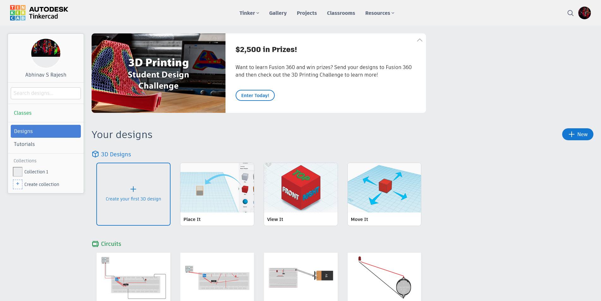
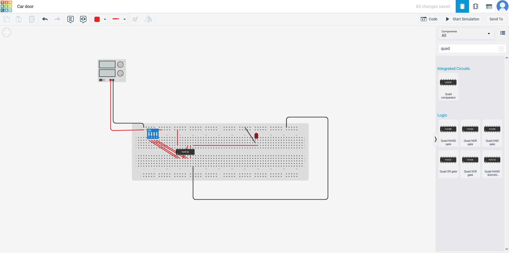
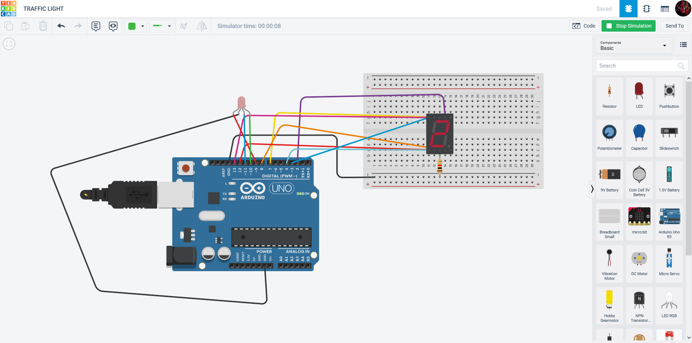

# DAY 1 - 02-05-23
**Inauguration** 
 
Our day started with a warmful speech given by the academic director of Jyothi engineering college.  
**Morning session** 
Our lecturer, Jinesh jose introduced us about Microprocessors and Microcontrollers. We got a brief idea on the topic after the class. Later 
we had taught about GitHub and what it is used for, We created an account on GitHub. Later on we created a repository on GitHub for our Internship.We can note or save anything related on coding on GitHub. 
# DAY 2 - 03-05-23
**Tinker Cad** 

Tinkercad is a free, web-based 3D modeling software developed by Autodesk, designed for beginners to create and print 3D models. It offers an intuitive and user-friendly interface that allows users to easily drag and drop shapes to create objects, as well as modify and combine them to create more complex designs. 

Tinkercad also provides a wide range of tools and features, including measurement tools, alignment tools, and shape generators, which can be used to create more intricate designs. Additionally, the software allows users to import and export files in various formats, making it compatible with other 3D design software and 3D printers. 

Overall, Tinkercad is a great option for anyone who is new to 3D modeling or wants to quickly create and print 3D objects without having to learn complex software. 
 
*[Front page of Tinker Cad](https://www.tinkercad.com/dashboard?collection=designs)*   
**Simulation of various circuits**  
Tinkercad is an online platform that allows users to design, create, and simulate various electronic circuits. It provides a wide range of components such as resistors, capacitors, diodes, transistors, LEDs, and sensors that can be used to create circuits for different applications.

To simulate a circuit on Tinkercad, users can drag and drop the desired components onto the circuit canvas and connect them using virtual wires. The platform also provides a built-in library of pre-made circuits that users can use as a starting point for their designs.

Tinkercad also allows users to simulate the behavior of their circuits in real-time, which provides feedback on the circuit's performance. This can help users identify and fix any issues with their circuit before they build it in real life.

Additionally, Tinkercad has a built-in programming environment based on the Arduino programming language that allows users to write and upload code to their circuits. This feature can be used to control the behavior of the circuit and add additional functionality.

Overall, Tinkercad is a powerful tool for simulating various circuits and experimenting with different designs, making it an excellent resource for anyone interested in electronics and circuit design. 
 
*[Simulation page of Tinker cad](https://www.tinkercad.com/things/jpbTXTyItAS)*   
**Simulation of ardino projects on Tinker cad**  
Tinkercad is an online platform that allows users to create and simulate electronic circuits, including Arduino-based circuits, without the need for physical hardware. 

To simulate an Arduino on Tinkercad, users can select an Arduino board from the platform's built-in library and drag and drop it onto the circuit canvas. From there, they can add other components such as resistors, LEDs, sensors, and motors and connect them to the board using virtual wires.

Tinkercad also includes a built-in programming environment based on the Arduino programming language, which allows users to write and upload code to their simulated Arduino board. The code can be tested and debugged in the Tinkercad simulation environment, which provides real-time feedback on the behavior of the circuit.

Simulating an Arduino on Tinkercad can be a useful tool for learning and experimenting with electronics and programming, as it allows users to test their designs and code without the risk of damaging physical hardware. 
 
*[Simulation of traffic signal using ardino on Tinker cad](https://www.example.com)*  
# DAY 3 - 04-05-23
More project simulations are done today, 
**projects**:[Traffic light using button on ardino](https://www.tinkercad.com/things/2k1oGcnvp35) 
             [Displaying "GPTC CHELAKKARA" on LCD](https://www.tinkercad.com/things/hduM5454fmF) 
